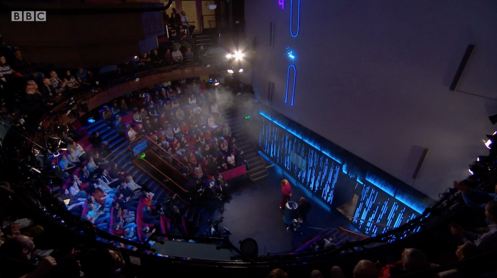

# Description

Attempt to re-create the JavaScript game created by Dr. Hannah Fry's guest, Seb Lee-Delisle, during the
Royal Institution Christmas Lectures 2019 part 2 (time 05:06 - 10:40).

# Keyboard actions

| Key | Description |
| --- | ----------- |
| Up Arrow | Apply an upward force on the sparkler |
| M | Toggle microphone on/off. When on, making a noise applies an upward force on the sparkler |
| V | Toggle live visualisation of the microphone signal on/off |
| B | Emit a burst |

# TODO

* ~~Animate single particle~~
* ~~Animate multiple particles~~
* ~~Use multiple colours in the sparkler~~
* ~~Add gravity effect~~
* ~~Add shrinking effect~~
* ~~Add fading effect~~
* Add glow effect (may need to switch to SVG or THREE.js for this)
* Add drag effect to the sparkler particles
* ~~Add burst effect (via the 'B' key)~~
* ~~Add ability to keep the sparkler in the air by applying boosts via the up arrow key~~
* ~~Add ability to control the upward boost via the microphone volume level~~
* ~~Add obstacles~~
* ~~Add horizontal scrolling of the obstacles~~
* ~~Add collision detection of the sparkler colliding with obstacles~~
* ~~Trigger the burst effect after successfully navigating each obstacle~~
* Display the current score (count of successfully navigated obstacles)
* Handle game over on collision and show final score

# Links

* [Seb Lee-Delisle on GitHub](https://github.com/sebleedelisle)
* [Modeling Physics in Javascript: Gravity and Drag](https://burakkanber.com/blog/modeling-physics-javascript-gravity-and-drag/)
