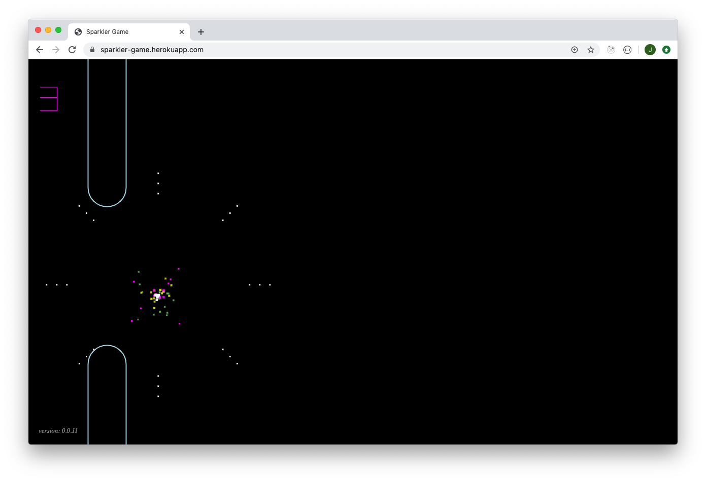

# Description

Attempt to re-create the game presented by Dr. Hannah Fry's guest, Seb Lee-Delisle, during the
Royal Institution Christmas Lectures 2019, Lecture 2. See [clip](https://youtu.be/AJJS80lbpJs?t=560).

## Still frame from the clip

## Screenshot of the web app

# Game play

## Not using the microphone

* Use the up arrow key or click/tap to start the game and keep the sparkler in the air
* Use the return key or click/tap to play again when the game is over

## Using the microphone

* Turn on the microphone on by clicking/tapping the red muted microphone icon
  * Give permission to use the microphone
* Make a noise to start the game and make more noise to keep the sparkler in the air
* Use the return key or click/tap to play again when the game is over
* Click/tap the green microphone icon to turn the microphone off when you have finished playing the game

# Browser compatibility

## Audio

Initially, I used the Web Audio API [AudioWorklet](https://developer.mozilla.org/en-US/docs/Web/API/AudioWorklet) interface. However, this does not appear to be widely implemented.
I am now using the [audioworklet-polyfill](https://github.com/GoogleChromeLabs/audioworklet-polyfill)
which tries to use [AudioWorklet](https://developer.mozilla.org/en-US/docs/Web/API/AudioWorklet)
but falls back to [ScriptProcessorNode](https://developer.mozilla.org/en-US/docs/Web/API/ScriptProcessorNode).

# TODO

* ~~Animate single particle~~
* ~~Animate multiple particles~~
* ~~Use multiple colours in the sparkler~~
* ~~Add gravity effect~~
* ~~Add shrinking effect~~
* ~~Add fading effect~~
* Add glow effect (may need to switch to SVG or THREE.js for this)
* Add drag effect to the sparkler particles
* ~~Add burst effect (via the 'B' key)~~
* ~~Add ability to keep the sparkler in the air by applying boosts via the up arrow key~~
* ~~Add ability to control the upward boost via the microphone volume level~~
* ~~Add obstacles~~
* ~~Add horizontal scrolling of the obstacles~~
* ~~Add collision detection of the sparkler colliding with obstacles~~
* ~~Trigger the burst effect after successfully navigating each obstacle~~
* ~~Display the current score (count of successfully navigated obstacles)~~
* ~~Handle game over on collision and show final score~~
* ~~Support mobile/touchscreen devices~~

# Links

* [Clip](https://youtu.be/AJJS80lbpJs?t=560)
* [Seb Lee-Delisle on GitHub](https://github.com/sebleedelisle)
* [Royal Institution tweet re crowd-noise laser](https://twitter.com/Ri_Science/status/1210654725529624576?s=20)
* [Modeling Physics in Javascript: Gravity and Drag](https://burakkanber.com/blog/modeling-physics-javascript-gravity-and-drag/)
* [Vector Battle Font](https://www.fontspace.com/freaky-fonts/vector-battle)
* [Font Awesome Free License](https://fontawesome.com/license/free)
* [Writing Web Audio API code that works in every browser](https://developer.mozilla.org/en-US/docs/Web/Guide/Audio_and_video_delivery/Web_Audio_API_cross_browser)
* [audioworklet-polyfill](https://github.com/GoogleChromeLabs/audioworklet-polyfill)
